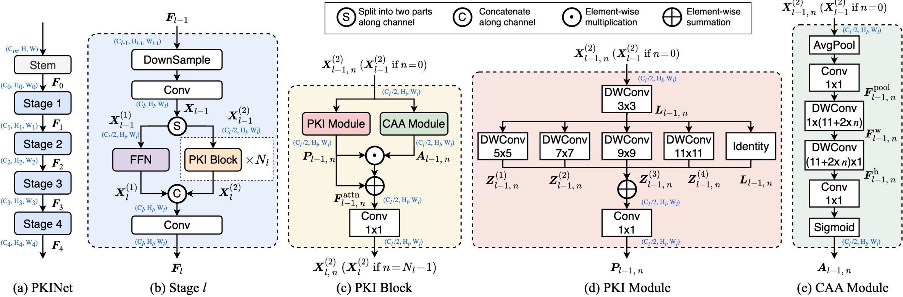
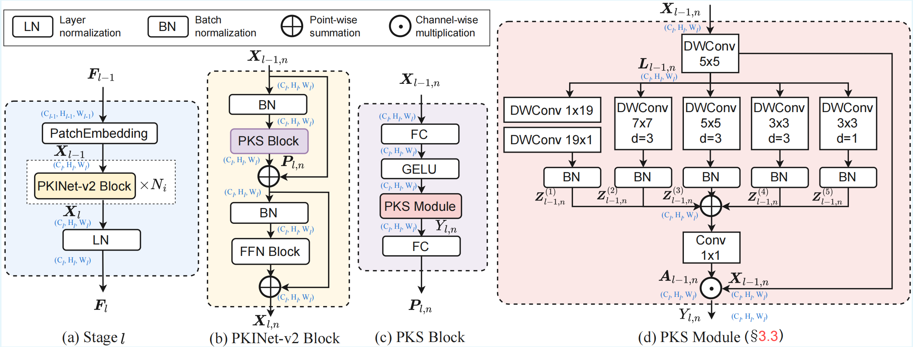

# Poly Kernel Inception Networks for Remote Sensing Detection

## Introduction 👋

This repository contains the implementations of **PKINet** (CVPR2024) and **PKINet-v2** for remote sensing object detection.

- **PKINet** is the original poly-kernel backbone for remote sensing detection.
- **PKINet-v2** further improves both **detection accuracy** and **inference efficiency** over PKINet.

<p align="center">
  
</p>

<p align="center">
  <em>Pipeline of PKINet.</em>
</p>

<p align="center">
  
</p>

<p align="center">
  <em>Pipeline of PKINet-v2.</em>
</p>

---

## Papers 📄

### PKINet (CVPR 2024)
- **Poly Kernel Inception Network for Remote Sensing Detection**: [arXiv](https://arxiv.org/abs/2403.06258)

### PKINet-v2
- **PKINet-v2: Towards Powerful and Efficient Poly-Kernel Remote Sensing Object Detection**: [arXiv](https://arxiv.org/abs/2603.16341)

---

## Model Zoo 📦

### PKINet-v2

#### Pretrained Models

- **PKINet-v2-T backbone**(ImageNet, 300 epochs): [Download](https://1drv.ms/u/c/9ce9a57f1a400a74/IQDPF7bEfpD7SIgos_RAaq_zAdZ8RiVd7d-sR8ygxy6G5E4)
- **PKINet-v2-S backbone**(ImageNet, 300 epochs): [Download](https://1drv.ms/u/c/9ce9a57f1a400a74/IQCJyDqg_XwDQrZUWHgAHdevAWw3icMGez-sxLsHqEgKCxg?e=aud6as)

#### DOTA-v1.0

| Model | Detector | mAP | Angle | Config | Dev-Config | Weights |
|:--|:--|:--:|:--:|:--|:--|:--|
| PKINet-v2-T | Oriented R-CNN | 79.36 | le90 | [config](configs/pkinet-v2/pkinet-v2-t_fpn_o-rcnn_3x_dotav1-ss_le90.py) | - | [model](https://1drv.ms/u/c/9ce9a57f1a400a74/IQABDi6m2KwFSKmu9H2Nvye0ASdS5RcIhcEIYyelTtS6au8?e=6cvw5Z) |
| PKINet-v2-S | Oriented R-CNN | 80.46 | le90 | [config](configs/pkinet-v2/pkinet-v2-s_fpn_o-rcnn_3x_dotav1-ss_le90.py) | [develop](configs/pkinet-v2/pkinet-v2-s_fpn_o-rcnn_3x_dotav1-ss_le90_develop.py) | [model](https://1drv.ms/u/c/9ce9a57f1a400a74/IQALZ6rAL-D1TK4Iv9PUidUYAe2rIXUF5gvBXHSRqgwiCvc?e=cI9ev6) |
| PKINet-v2-S | Rotated Faster R-CNN | 79.02 | le90 | [config](configs/pkinet-v2/pkinet-v2-s_fpn_r-faster-rcnn_3x_dotav1-ss_le90.py) | [develop](configs/pkinet-v2/pkinet-v2-s_fpn_r-faster-rcnn_3x_dotav1-ss_le90_develop.py) | [model](https://1drv.ms/u/c/9ce9a57f1a400a74/IQAZHmlm-WbDTayB-alZJfTbAdCW3a3RLuN33XUjxBHp_sE?e=sKOPjP) |
| PKINet-v2-S | Rotated FCOS | 77.13 | le90 | [config](configs/pkinet-v2/pkinet-v2-s_fpn_r-fcos_3x_dotav1-ss_le90.py) | [develop](configs/pkinet-v2/pkinet-v2-s_fpn_r-fcos_3x_dotav1-ss_le90_develop.py) | [model](https://1drv.ms/u/c/9ce9a57f1a400a74/IQCgkOprxPMdSJnj_vIrsEVcAaFWmk_Zc7bJHuXTsI1uMCU?e=0466Ja) |
| PKINet-v2-S | R3Det | 77.64 | oc | [config](configs/pkinet-v2/pkinet-v2-s_fpn_r3det_3x_dotav1-ss_le90.py) | [develop](configs/pkinet-v2/pkinet-v2-s_fpn_r3det_3x_dotav1-ss_le90_develop.py) | [model](https://1drv.ms/u/c/9ce9a57f1a400a74/IQBogttwRQZHRYH9OF9w6D7NAQQtPbkN0n84AbHoe9gW60g?e=CZphD6) |
| PKINet-v2-S | RoI Transformer | 79.87 | le90 | [config](configs/pkinet-v2/pkinet-v2-s_fpn_roitrans_3x_dotav1-ss_le90.py) | [develop](configs/pkinet-v2/pkinet-v2-s_fpn_roitrans_3x_dotav1-ss_le90_develop.py) | [model](https://1drv.ms/u/c/9ce9a57f1a400a74/IQC7Z_VowxeQSLZ_Y217l6ulAfyOAws0tJ3EIexwvMQrV5I?e=jl5Krg) |
| PKINet-v2-S | S2ANet | 79.68 | le135 | [config](configs/pkinet-v2/pkinet-v2-s_fpn_s2a_3x_dotav1-ss_le90.py) | [develop](configs/pkinet-v2/pkinet-v2-s_fpn_s2a_3x_dotav1-ss_le90_develop.py) | [model](https://1drv.ms/u/c/9ce9a57f1a400a74/IQDf1C0nqCFzSav5wJG0D0sKAT7WyySyoeDVsBW7qyYHYRg?e=xCaqxB) |

#### DOTA-v1.5

| Model | Detector | mAP | Angle | Config | Weights |
|:--|:--|:--:|:--:|:--|:--|
| PKINet-v2-S | Oriented R-CNN | 73.57 | le90 | [config](configs/pkinet-v2/pkinet-v2-s_fpn_o-rcnn_3x_dotav15-ss_le90_develop.py) | [model](https://1drv.ms/u/c/9ce9a57f1a400a74/IQA-LWDjB-HXSYsWuaF7sPvGAZuWH5qpATstRmNaEhvIZqU?e=JHJimJ) |

---

### PKINet

#### Pretrained Models

- **PKINet-T backbone** (ImageNet, 300 epochs): [Download](https://1drv.ms/u/c/9ce9a57f1a400a74/EXQKQBp_pekggJxvAAAAAAABWyCuNnKnuiA47qX6Wr7TMQ?e=pWhU1h)
- **PKINet-S backbone** (ImageNet, 300 epochs): [Download](https://1drv.ms/u/c/9ce9a57f1a400a74/EXQKQBp_pekggJxrAAAAAAAB46whGHAZkAw-Pnkwgc_OWQ?e=n0NrZl)

#### DOTA-v1.0

| Model | mAP | Angle | Config | Weights |
|:--|:--:|:--:|:--|:--|
| PKINet-T (1024,1024,200) | 77.87 | le90 | [pkinet-t_fpn_o-rcnn_dotav1-ss_le90](./configs/pkinet/pkinet-t_fpn_o-rcnn_dotav1-ss_le90.py) | [model](https://1drv.ms/u/c/9ce9a57f1a400a74/EXQKQBp_pekggJxuAAAAAAABKAmGDsIXgkjY5_WjNzQorQ?e=Lcibnd) |
| PKINet-S (1024,1024,200) | 78.39 | le90 | [pkinet-s_fpn_o-rcnn_dotav1-ss_le90](./configs/pkinet/pkinet-s_fpn_o-rcnn_dotav1-ss_le90.py) | [model](https://1drv.ms/u/c/9ce9a57f1a400a74/EXQKQBp_pekggJxsAAAAAAABWxHIx4vrnkZsRy1JW3BRaw?e=e07o7V) |

#### DOTA-v1.5

| Model | mAP | Angle | Config | Weights |
|:--|:--:|:--:|:--|:--|
| PKINet-S (1024,1024,200) | 71.47 | le90 | [pkinet-s_fpn_o-rcnn_dotav15-ss_le90](./configs/pkinet/pkinet-s_fpn_o-rcnn_dotav15-ss_le90.py) | [model](https://1drv.ms/u/c/9ce9a57f1a400a74/EXQKQBp_pekggJxtAAAAAAABYD69GUAHCtBp4RRSoKLuYQ?e=xh6iwO) |

---

## Setup 🛠️

MMRotate-PKINet depends on [PyTorch](https://pytorch.org/), [MMCV](https://github.com/open-mmlab/mmcv), [MMDetection](https://github.com/open-mmlab/mmdetection), and [MMEngine](https://github.com/open-mmlab/mmengine).

For more details, please refer to the [MMRotate installation guide](https://mmrotate.readthedocs.io/en/latest/install.html).

```shell
conda create --name pkinet python=3.8 -y
conda activate pkinet
conda install pytorch==1.12.1 torchvision==0.13.1 torchaudio==0.12.1 cudatoolkit=11.3 -c pytorch
pip install yapf==0.40.1
pip install -U openmim
mim install mmcv-full
mim install mmdet
mim install mmengine
git clone https://github.com/NUST-Machine-Intelligence-Laboratory/PKINet.git
cd PKINet
mim install -v -e .
```

---

## Training and Testing 🚀

Please see [get_started.md](docs/en/get_started.md) for the basic usage of MMRotate.

We also provide tutorials for:

- [learn the basics](docs/en/intro.md)
- [learn the config](docs/en/tutorials/customize_config.md)
- [customize dataset](docs/en/tutorials/customize_dataset.md)
- [customize model](docs/en/tutorials/customize_models.md)
- [useful tools](docs/en/tutorials/useful_tools.md)

### PKINet-v2 (taking pkinet-v2-s_fpn_o-rcnn as an example)

#### 1. Download ImageNet pretrained backbone and place it into ``pretrain/``

- **PKINet-v2-S backbone**(ImageNet, 300 epochs): [Download](https://1drv.ms/u/c/9ce9a57f1a400a74/IQCJyDqg_XwDQrZUWHgAHdevAWw3icMGez-sxLsHqEgKCxg?e=aud6as)

#### 2. Train PKINet-v2

```bash
bash ./tools/dist_train.sh configs/pkinet-v2/pkinet-v2-s_fpn_o-rcnn_3x_dotav1-ss_le90.py 4
```

#### 3. Convert a trained PKINet-v2 checkpoint to the deploy version

```bash
python tools/pkinet/convert_pkinet_to_deploy.py \
  configs/pkinet-v2/pkinet-v2-s_fpn_o-rcnn_3x_dotav1-ss_le90.py \
  work_dirs/pkinet-v2-s_fpn_o-rcnn_3x_dotav1-ss_le90/latest.pth \
  work_dirs/pkinet-v2-s_fpn_o-rcnn_3x_dotav1-ss_le90/pkinet-v2-s-deploy.pth
```

#### 4. Test the deploy model

```bash
bash ./tools/dist_test.sh \
  configs/pkinet-v2/pkinet-v2-s_fpn_o-rcnn_3x_dotav1-ss_le90_deploy.py \
  work_dirs/pkinet-v2-s_fpn_o-rcnn_3x_dotav1-ss_le90/pkinet-v2-s-deploy.pth \
  4 \
  --format-only \
  --eval-options submission_dir=work_dirs/results/pkinet-v2-dota
```

#### 5. Submit the result to [DOTA-v1.0 server](http://bed4rs.net:8001/evaluation1)

> [!IMPORTANT]
> If you care more about **inference speed**, we strongly recommend **PyTorch 2.4.1 + CUDA 11.8**, which is more efficient for **large-kernel inference** for inference. However, the training stability of this version has not been thoroughly verified, so we do not recommend using it for training.
```
conda create --name pkinet-dev python=3.10 -y
conda activate pkinet-dev
pip install torch==2.4.1 torchvision==0.19.1 torchaudio==2.4.1 --index-url https://download.pytorch.org/whl/cu118
pip install yapf==0.40.1
pip install -U openmim
mim install mmcv-full
mim install mmdet
mim install mmengine
git clone https://github.com/NUST-Machine-Intelligence-Laboratory/PKINet.git
cd PKINet
mim install -v -e .
```

### PKINet

#### 1. Train PKINet

```bash
bash ./tools/dist_train.sh configs/pkinet/pkinet-s_fpn_o-rcnn_dotav1-ss_le90.py 4
```

---

## License 📜

This project is released under the [Apache 2.0 license](LICENSE).

---

## Citation 📚

If you find this repository useful, please consider citing:

```bibtex
@inproceedings{cai2024poly,
    author    = {Cai, Xinhao and Lai, Qiuxia and Wang, Yuwei and Wang, Wenguan and Sun, Zeren and Yao, Yazhou},
    title     = {Poly Kernel Inception Network for Remote Sensing Detection},
    booktitle = {Proceedings of the IEEE/CVF Conference on Computer Vision and Pattern Recognition (CVPR)},
    month     = {June},
    year      = {2024},
    pages     = {27706-27716}
}
```

```bibtex
@article{cai2026pkinetv2,
  title={PKINet-v2: Towards Powerful and Efficient Poly-Kernel Remote Sensing Object Detection},
  author={Cai, Xinhao and Liulei Li and Gensheng Pei and Zeren Sun and Yazhou Yao and Wenguan Wang},
  journal={arXiv preprint arXiv:2603.16341},
  year={2026}
}
```
